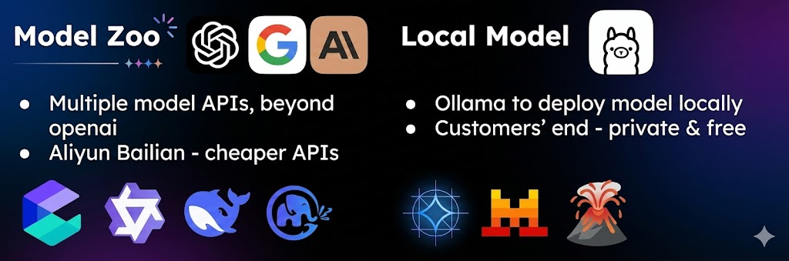

# FinGOAT: 基于图结构的智能代理金融交易系统

[English](./README.md) | [中文](./README-CN.md)

**演示视频**: [YouTube](https://youtu.be/f5eHl32v5gU)

FinGOAT 是一个全栈金融智能系统，融合了实时数据采集、图结构知识建模以及智能代理决策流程。
系统采用 Go 后端（Gin + GORM + PostgreSQL + Redis）和 Vite 驱动的 TypeScript/React 前端。


**致敬源项目：**

感谢 [Tauric Research](https://github.com/TauricResearch) 团队的多智能体交易框架 [TradingAgents](https://github.com/TauricResearch/TradingAgents)！

## 部署
- 英文部署指南：[DEPLOYMENT.md](./DEPLOYMENT.md)
- 中文部署指南：[DEPLOYMENT-CN.md](./DEPLOYMENT-CN.md)

## 快速开始

### 克隆仓库

```bash
git clone https://github.com/JerryLinyx/FinGOAT.git
cd FinGOAT
```

### 后端配置 (Gin+GORM+PostgreSQL+Redis+Viper+JWT+Docker)

#### 安装依赖
```bash
cd backend

go mod init github.com/JerryLinyx/FinGOAT

go get -u github.com/gin-gonic/gin
go get github.com/spf13/viper
go get -u gorm.io/gorm
go get -u gorm.io/driver/postgres
go get -u google.golang.org/grpc
go get -u golang.org/x/crypto/bcrypt
go get github.com/golang-jwt/jwt/v5
go get -u github.com/go-redis/redis/v8
go get github.com/gin-contrib/cors

go mod tidy
```

#### 启动 PostgreSQL
```bash
docker pull postgres:15.14-alpine3.21

docker run --name fingoat-pg \
  --restart=unless-stopped \
  -d -p 5432:5432 \
  -v pgdata:/var/lib/postgresql/data \
  -e POSTGRES_USER=postgres \
  -e POSTGRES_PASSWORD=2233 \
  -e POSTGRES_DB=fingoat_db \
  postgres:15.14-alpine3.21
```
#### 启动 Redis
```bash
docker run -d \
  --name fingoat-redis \
  -p 6379:6379 \
  -v redisdata:/data \
  redis:7.2
```
#### 运行服务器
```bash
go run main.go
# curl http://localhost:3000/api/trading/health
```


### 前端配置 (TypeScript+Vite+React)
```bash
npm create vite@latest frontend

cd frontend
npm install
npm run build
npm run dev
# http://localhost:5173/
```

### 智能代理配置 (LangChain+LangGraph+FastAPI)

1) 创建 Python 环境并安装依赖
```bash
cd langchain-v1
python3 -m venv .venv
source .venv/bin/activate

# 如果需要
conda deactivate

pip install --upgrade pip
pip install -r requirements.txt

# 对于 python3
# python3 -m pip install --upgrade pip
# python3 -m pip install -r requirements.txt
```

2) 配置 API 密钥和服务设置
```bash
cp .env.trading .env
# 设置 OPENAI_API_KEY 和 ALPHA_VANTAGE_API_KEY（或其他 API）
# 如需要，调整 TRADING_SERVICE_PORT / CORS_ORIGINS
```

3) 运行 FastAPI 微服务
```bash
# 开发模式（自动重载，日志输出到控制台）
python trading_service.py
# python3 trading_service.py
# http://localhost:8001/

# 生产模式
uvicorn trading_service:app --host 0.0.0.0 --port 8001 --workers 4
```
服务文档位于 http://localhost:8001/docs，健康检查位于 `/health`。

4) 触发分析的示例请求
```bash
curl -X POST http://localhost:8001/api/v1/analyze \
  -H "Content-Type: application/json" \
  -d '{
        "ticker": "NVDA",
        "date": "2024-05-10",
        "llm_config": {
          "deep_think_llm": "gpt-4o-mini",
          "quick_think_llm": "gpt-4o-mini",
          "max_debate_rounds": 1
        }
      }'
```
响应返回一个 `task_id`；轮询 `/api/v1/analysis/{task_id}` 获取结果。

#### 界面展示
**登录页面**


**仪表板页面**


## 项目概述

FinGOAT（Financial Graph-Orchestrated Agentic Trading，基于图结构的智能代理金融交易系统）通过图编排的异步多智能体，让现代 LLM 分析与 CFA 风格流程对齐。各分析角色保持独立、量化打分并经风险调整，而不是强制共识；基本面分析用 RAG 绑定真实财报/公告，结果持久化便于追溯。

**核心特点**
- 图编排 + 异步多智能体（LangGraph），替代线性链路，降低延迟、提升稳定性。
- 结合 PM/RM 实践的量化信念度与风险调整，决策可解释、可追踪。
- 基本面 RAG 基于财报/会议纪要；技术/新闻/情绪等分析保持独立。
- 灵活的 LLM 提供方（OpenAI/Anthropic/Google/DeepSeek/阿里云等），支持 Ollama/vLLM 本地推理。
- 生产化栈：Go（Gin+GORM+JWT）API 网关、FastAPI Agent 服务、React/Vite 前端、PostgreSQL+Redis、Docker Compose/K8s、Nginx 反向代理。

## 背景

### 金融领域的 LLM 演进
- LLM 已用于新闻解读、财报摘要、情绪和基本面分析，但多数流水线仍然不透明、偏慢。
- LangChain/LangGraph、Dify、N8N、Coze 等多角色框架已出现，但真实投研依赖独立观点、评分和风险控制。
- FinGOAT 用图编排的 CFA 风格多智能体填补这一缺口，强调可审计、低延迟。

## 问题陈述
- **透明度**：推理链路往往不清晰，难以追踪决策原因。
- **延迟**：顺序链路导致端到端耗时高，不利于交互式使用。
- **稳定性**：强制各异质代理共识容易导致不稳定、低信任输出。

## 我们的方案
- **图编排、异步多智能体**（LangGraph），压缩关键路径、提升可预测性。
- **量化信念度 + 风险调整**，将多源信号聚合为可解释的 BUY/SELL/HOLD。
- **RAG 基本面**，把 LLM 推理绑定到财报/纪要等真实文档，减少幻觉。
- **多提供方 + 本地模型**（OpenAI/Anthropic/Google/DeepSeek/阿里云；支持 Ollama/vLLM），平衡成本/隐私/延迟。
- **生产化落地**：Go API 网关、FastAPI Agent、React/Vite UI、PostgreSQL+Redis、Docker Compose/K8s、Nginx 入口代理。

### 如何工作（分析流程）
- 技术/新闻/情绪/基本面分析师异步运行，保持独立观点。
- PM 引擎聚合信号生成买/卖/持有和基础信念度。
- 风险管理器按公司/估值/情绪/宏观/分歧等因子调整信念。
- 决策与完整报告持久化到 PostgreSQL；Redis 做缓存；UI 提供摘要与 JSON 明细。

### 基本面 RAG
- 来源：SEC 10-K、财报电话会议记录、分析师报告、投研路演材料。
- 流水线：金融文档 → 向量化 → ChromaDB → RAG 提示 → 落地的基本面信号（方向、关键因子、风险）。

## 系统架构

### 全栈组件

#### 前端
- Vite + React UI，展示分析状态/结果，模型与 Provider 选择。
- Nginx 反向代理托管 SPA。

#### Go 后端（API 网关）
- Gin 路由 + CORS；JWT 认证；Viper 配置。
- GORM + PostgreSQL 持久化；go-redis 作为缓存/会话。

#### Python 代理服务
- FastAPI + LangChain/LangGraph 图编排代理。
- 多家 LLM 提供方（OpenAI/Anthropic/Google/DeepSeek/阿里云，Ollama/vLLM）。

#### 数据层
- PostgreSQL 存储任务/决策/文章。
- Redis 缓存，后续可用于流/事件。
- RSS 摄取新闻文章。

### 部署

- Docker Compose 支撑本地与类生产环境，Nginx 统一入口。
- Kubernetes 清单（`k8s/`）用于扩容、LB/Ingress、健康检查。
- Secrets 通过 env 或 K8s Secrets 注入；可替换为托管 DB/Redis。

## 模型库



### 支持的 LLM 提供商

系统支持 OpenAI 之外的多个模型 API：

#### 商业 API
| 提供商 | 模型 | 输入（每百万 token） | 输出（每百万 token） |
|----------|-------|----------------------|------------------------|
| OpenAI | GPT-4o | $2.50 | $10.00 |
| OpenAI | GPT-4o-mini | $0.15 | $0.60 |
| Anthropic | Claude 3.5 Sonnet | $3.00 | $15.00 |
| Google | Gemini 1.5 Pro | $1.25 | $5.00 |
| DeepSeek | DeepSeek V3 | $0.27 | $1.10 |

#### 成本效益选项
- **阿里云百炼**：用于成本敏感部署的更便宜的 API 替代方案
- **Ollama**：本地部署模型以实现私密和免费推理

### 本地模型部署 + 延迟评估

**Gemma 3 模型变体：**

| 模型 | 大小 | Ollama 命令 | 延迟（串行模式） |
|-------|------|----------------|----------------------|
| Gemma 3 1B | 815MB | `ollama run gemma3:1b` | 115.23s |
| Gemma 3 4B | 3.3GB | `ollama run gemma3` | 320.50s |
| Gemma 3 12B | 8.1GB | `ollama run gemma3:12b` | 690.82s |
| Gemma 3 27B | 17GB | `ollama run gemma3:27b` | 1131.48s |

**关键见解：**
- 小模型 → 低延迟；大模型 → 更强推理。
- 本地推理保护隐私、免 API 费；按场景权衡能力与响应时间。

## 未来工作

### 端到端实时交易循环
- 与真实经纪 API（Alpaca/Robinhood）集成
- 模拟和实时执行能力
- 实时投资组合跟踪

### 代理分歧和不确定性建模
- 跨代理协方差分析
- 分歧热图
- 不确定性感知的信念调整
- 当代理显著分歧时触发更深入的分析

### 强化学习投资组合代理
- 基于强化学习的投资组合优化
- 从市场反馈中自适应策略学习
- 多目标优化（收益、风险、回撤）

### 金融 RAG 2.0
- 针对金融文档的领域调优嵌入
- 金融知识图谱
- 具有时间感知的增强检索
- 多模态文档理解

### 个性化投资者画像
- 用户研究和行为分析
- 用户特定的风险曲线和投资期限
- 因子偏好和约束建模
- 定制化推荐引擎

## 贡献

欢迎贡献！


## 引用

如果您在研究中使用 FinGOAT，请引用：

```bibtex
@software{fingoat2025,
  title = {FinGOAT: Financial Graph-Orchestrated Agentic Trading},
  author = {Lin, Yuxuan and Qian, Gaolin and Gadde, Akhil},
  year = {2025},
  url = {https://github.com/JerryLinyx/FinGOAT}
}
```
