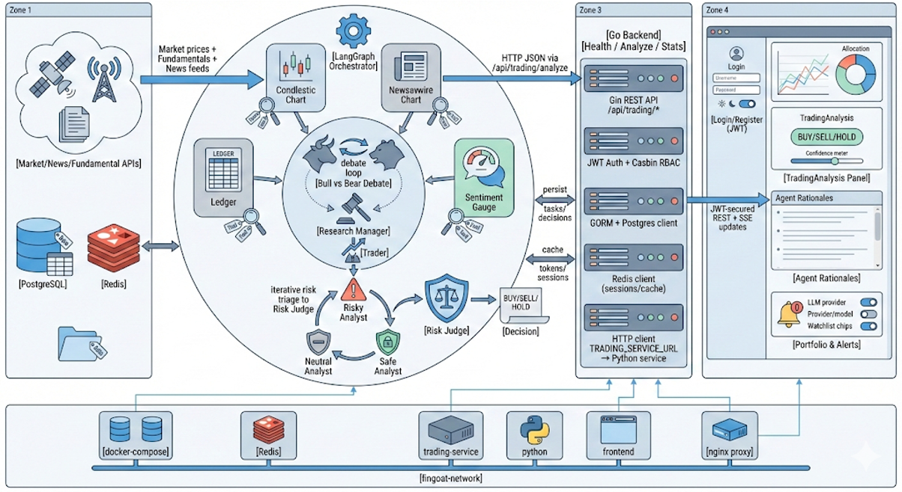
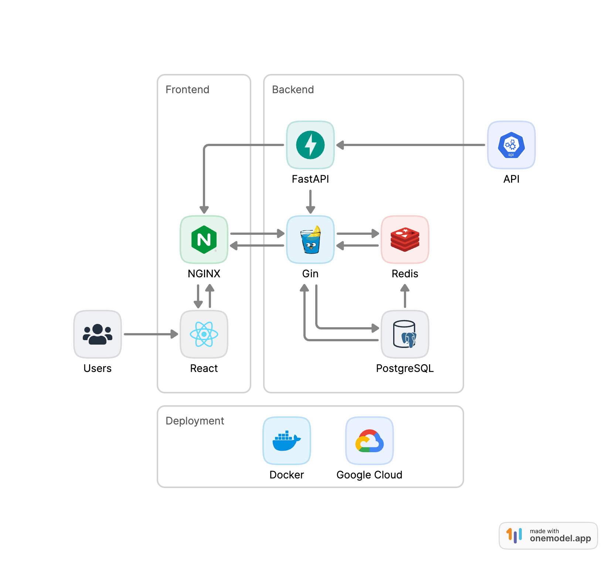
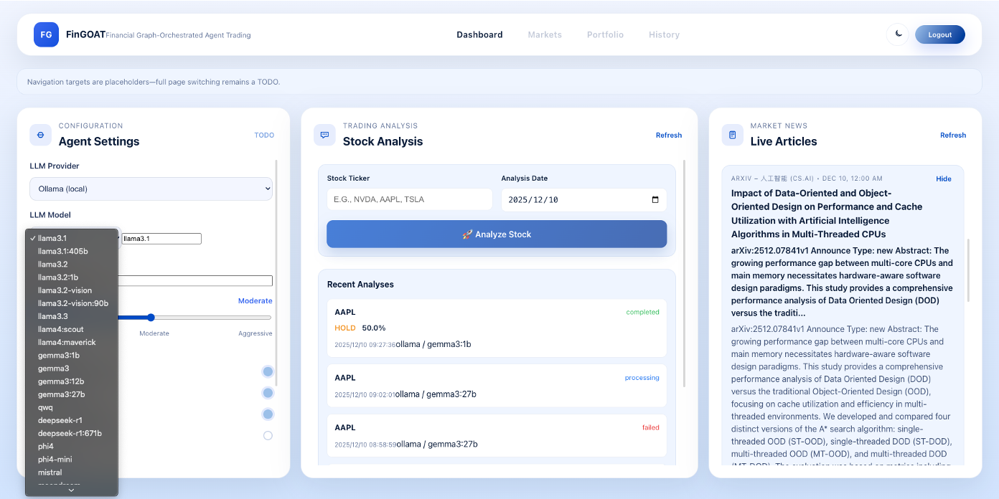

# FinGOAT: 基于图结构的智能代理金融交易系统

[English](./README.md) | [中文](./README-CN.md)

**演示视频**: [YouTube](https://youtu.be/f5eHl32v5gU)

FinGOAT 是一个全栈金融智能系统，融合了实时数据采集、图结构知识建模以及智能代理决策流程。
系统采用 Go 后端（Gin + GORM + PostgreSQL + Redis）和 Vite 驱动的 TypeScript/React 前端。



**致敬源项目**
感谢 [Tauric Research](https://github.com/TauricResearch) 团队的多智能体交易框架 [TradingAgents](https://github.com/TauricResearch/TradingAgents)！

## 快速开始

### 克隆仓库

```bash
git clone https://github.com/JerryLinyx/FinGOAT.git
cd FinGOAT
```

### 后端配置 (Gin+GORM+PostgreSQL+Redis+Viper+JWT+Docker)

#### 安装依赖
```bash
cd backend

go mod init github.com/JerryLinyx/FinGOAT

go get -u github.com/gin-gonic/gin
go get github.com/spf13/viper
go get -u gorm.io/gorm
go get -u gorm.io/driver/postgres
go get -u google.golang.org/grpc
go get -u golang.org/x/crypto/bcrypt
go get github.com/golang-jwt/jwt/v5
go get -u github.com/go-redis/redis/v8
go get github.com/gin-contrib/cors

go mod tidy
```

#### 启动 PostgreSQL
```bash
docker pull postgres:15.14-alpine3.21

docker run --name fingoat-pg \
  --restart=unless-stopped \
  -d -p 5432:5432 \
  -v pgdata:/var/lib/postgresql/data \
  -e POSTGRES_USER=postgres \
  -e POSTGRES_PASSWORD=2233 \
  -e POSTGRES_DB=fingoat_db \
  postgres:15.14-alpine3.21
```
#### 启动 Redis
```bash
docker run -d \
  --name fingoat-redis \
  -p 6379:6379 \
  -v redisdata:/data \
  redis:7.2
```
#### 运行服务器
```bash
go run main.go
# curl http://localhost:3000/api/trading/health
```



### 前端配置 (TypeScript+Vite+React)
```bash
npm create vite@latest frontend

cd frontend
npm install
npm run build
npm run dev
# http://localhost:5173/
```

### 智能代理配置 (LangChain+LangGraph+FastAPI)

1) 创建 Python 环境并安装依赖
```bash
cd langchain-v1
python3 -m venv .venv
source .venv/bin/activate

# 如果需要
conda deactivate

pip install --upgrade pip
pip install -r requirements.txt

# 对于 python3
# python3 -m pip install --upgrade pip
# python3 -m pip install -r requirements.txt
```

2) 配置 API 密钥和服务设置
```bash
cp .env.trading .env
# 设置 OPENAI_API_KEY 和 ALPHA_VANTAGE_API_KEY（或其他 API）
# 如需要，调整 TRADING_SERVICE_PORT / CORS_ORIGINS
```

3) 运行 FastAPI 微服务
```bash
# 开发模式（自动重载，日志输出到控制台）
python trading_service.py
# python3 trading_service.py
# http://localhost:8001/

# 生产模式
uvicorn trading_service:app --host 0.0.0.0 --port 8001 --workers 4
```
服务文档位于 http://localhost:8001/docs，健康检查位于 `/health`。

4) 触发分析的示例请求
```bash
curl -X POST http://localhost:8001/api/v1/analyze \
  -H "Content-Type: application/json" \
  -d '{
        "ticker": "NVDA",
        "date": "2024-05-10",
        "llm_config": {
          "deep_think_llm": "gpt-4o-mini",
          "quick_think_llm": "gpt-4o-mini",
          "max_debate_rounds": 1
        }
      }'
```
响应返回一个 `task_id`；轮询 `/api/v1/analysis/{task_id}` 获取结果。

#### 界面展示
**登录页面**


**仪表板页面**


## 项目概述

FinGOAT（Financial Graph-Orchestrated Agentic Trading，基于图结构的智能代理金融交易系统）是一个全栈金融智能系统，弥合了现代基于大语言模型的分析与传统 CFA 标准投资工作流程之间的差距。该系统将实时数据解读与严格的金融理论和领域专业判断相结合，模拟真实投资团队的运作方式：独立观点、透明评分和风险驱动的决策流程。

## 背景

### 金融分析的演进

- **金融领域的大语言模型**：大语言模型越来越多地用于解读金融新闻、基本面、财报电话会议和情绪信号
- **智能代理框架**：最近的框架（如 LangChain、Dify、N8N、Coze）展示了使用大语言模型的多角色分析师流水线
- **现代资产管理**：实时新闻解读、严格的金融理论和领域专业判断
- **真实投资团队**：独立观点、透明评分和风险驱动的决策流程

FinGOAT 旨在通过提供**图编排的多智能代理**来弥合这一差距，将基于大语言模型的分析与符合 CFA 标准、量化结构化和透明的投资工作流程相结合。

## 问题陈述

当前的多智能代理交易框架面临几个关键挑战：

### 透明度有限
- 多阶段交互，推理模糊
- 代理意见不一致
- 难以追踪决策过程

### 高延迟
- 多轮顺序执行
- 代理协调中的瓶颈

### 结果不稳定
- "所有代理必须收敛"的假设不现实
- 缺乏稳健的分歧处理机制

### 参考文献： 
- [Blackrock Alpha Agent](https://arxiv.org/pdf/2508.11152v1)
- [Trading Agents](arxiv.org/pdf/2412.20138)

## 我们的解决方案

### 带有 COF + 自我反思的多智能代理层

**关键改进：**

1. **异步分析师执行**
   - 并行处理分析师代理
   - 显著减少端到端运行时间

2. **增强的提示工程**
   - 思维链（COF）推理
   - 自我反思机制

3. **简化的、符合 CFA 标准的投资工作流程**
   - 与专业投资分析标准保持一致
   - 透明的决策过程

4. **量化和基于因子的评分**
   - 客观、可衡量的信念分数
   - 风险调整后的建议

### 通过 MCP 调用的量化评分

#### PM 引擎
- **方向**：买入/卖出/持有建议
- **基础信念**：初始置信度分数

#### 风险管理器
基于多个风险因素调整信念：
- 公司特定风险
- 估值不确定性
- 情绪风险
- 宏观风险
- 分析师分歧

### 样本分析工作流程

系统提供跨多个维度的综合分析：

1. **技术分析**：图表模式、动量指标、成交量分析
2. **社交媒体情绪**：来自 Twitter、Reddit、StockTwits 的实时情绪
3. **新闻分析**：突发新闻影响和情绪
4. **基本面**：财务报表、比率、增长指标
5. **估值**：DCF、倍数、同行比较
6. **PM 引擎**：投资组合管理建议
7. **风险管理**：多因子风险评估

NVDA 的示例输出：
- **方向**：买入
- **信念**：+10%
- **关键输出**：来自每个代理的详细分析及支持证据

### 基本面分析师的 RAG 架构

系统处理各种金融文档：
- 包含实际财务报表的 SEC 10-K 文件
- 季度电话会议中管理层评论的财报记录
- 包含目标价的分析师报告
- 包含实际数据的公司投资者演示文稿

**RAG 流水线：**
```
金融文档 → 嵌入 → ChromaDB → RAG 流水线
```

## 系统架构

### 全栈组件

#### 前端
- **框架**：Vite + React 用于 UI
- **代理**：Nginx 用于反向代理
- **功能**：实时仪表板、分析可视化、多 LLM 提供商支持

#### Go 后端
- **路由器**：Gin 支持 CORS
- **认证**：JWT 用于安全访问
- **配置**：Viper 用于灵活的配置管理
- **数据库**：GORM 用于 PostgreSQL ORM，Go-Redis 用于缓存

#### 数据库层
- **PostgreSQL**：用于一致性的主数据存储
- **Redis**：用于性能的缓存层
- **RSS 订阅**：实时文章摄取

#### Python 后端
- **API**：FastAPI 用于代理服务
- **编排**：LangChain/LangGraph 用于代理协调
- **多 LLM 支持**：OpenAI、Anthropic、Google、DeepSeek、阿里云百炼、本地 Ollama 模型

### 部署

**容器化：**
- Docker Compose 用于服务隔离
- 前端、后端、数据库和代理服务的独立容器

**云基础设施：**
- 部署在 GCP VM 上
- 负载均衡以实现高可用性
- API 密钥和凭证的秘密管理

## 模型库

### 支持的 LLM 提供商

系统支持 OpenAI 之外的多个模型 API：

#### 商业 API
| 提供商 | 模型 | 输入（每百万 token） | 输出（每百万 token） |
|----------|-------|----------------------|------------------------|
| OpenAI | GPT-4o | $2.50 | $10.00 |
| OpenAI | GPT-4o-mini | $0.15 | $0.60 |
| Anthropic | Claude 3.5 Sonnet | $3.00 | $15.00 |
| Google | Gemini 1.5 Pro | $1.25 | $5.00 |
| DeepSeek | DeepSeek V3 | $0.27 | $1.10 |

#### 成本效益选项
- **阿里云百炼**：用于成本敏感部署的更便宜的 API 替代方案
- **Ollama**：本地部署模型以实现私密和免费推理

### 本地模型部署 + 延迟评估

**Gemma 3 模型变体：**

| 模型 | 大小 | Ollama 命令 | 延迟（串行模式） |
|-------|------|----------------|----------------------|
| Gemma 3 1B | 815MB | `ollama run gemma:3b` | 115.23s |
| Gemma 3 4B | 3.3GB | `ollama run gemma:4b` | 320.50s |
| Gemma 3 12B | 8.1GB | `ollama run gemma:12b` | 690.82s |
| Gemma 3 27B | 17GB | `ollama run gemma:27b` | 1131.48s |

**关键见解：**
- 较小的模型提供较低的延迟
- 本地部署确保隐私并消除 API 成本
- 模型能力与响应时间之间的权衡

## 未来工作

### 端到端实时交易循环
- 与真实经纪 API（Alpaca/Robinhood）集成
- 模拟和实时执行能力
- 实时投资组合跟踪

### 代理分歧和不确定性建模
- 跨代理协方差分析
- 分歧热图
- 不确定性感知的信念调整
- 当代理显著分歧时触发更深入的分析

### 强化学习投资组合代理
- 基于强化学习的投资组合优化
- 从市场反馈中自适应策略学习
- 多目标优化（收益、风险、回撤）

### 金融 RAG 2.0
- 针对金融文档的领域调优嵌入
- 金融知识图谱
- 具有时间感知的增强检索
- 多模态文档理解

### 个性化投资者画像
- 用户研究和行为分析
- 用户特定的风险曲线和投资期限
- 因子偏好和约束建模
- 定制化推荐引擎

## 贡献

欢迎贡献！


## 引用

如果您在研究中使用 FinGOAT，请引用：

```bibtex
@software{fingoat2025,
  title = {FinGOAT: Financial Graph-Orchestrated Agentic Trading},
  author = {Lin, Yuxuan and Qian, Gaolin and Gadde, Akhil},
  year = {2025},
  url = {https://github.com/JerryLinyx/FinGOAT}
}
```
