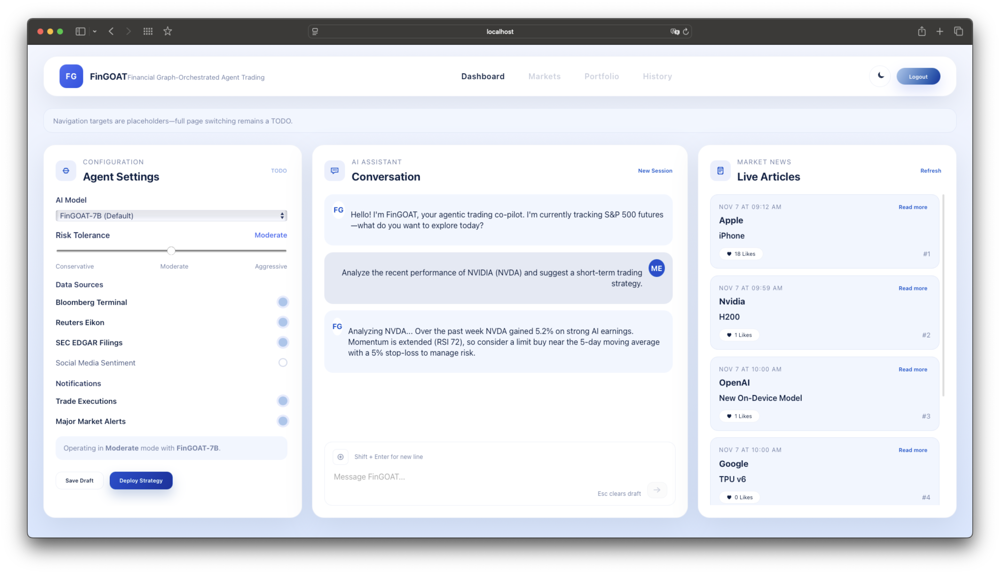

# FinGOAT: Financial Graph-Orchestrated Agentic Trading

[English](./README.md) | [中文](./README-CN.md)

FinGOAT is a full-stack financial intelligence system that combines real-time data ingestion, graph-structured knowledge modeling, and agentic decision workflows.
The stack includes a Go backend (Gin + GORM + PostgreSQL + Redis) and a TypeScript/React frontend built with Vite.

## Getting Started

### Backend Setup (Gin+GORM+PostgreSQL+Redis+Viper+JWT+Docker)

#### Install dependencies
```bash
go mod init github.com/JerryLinyx/FinGOAT

go get -u github.com/gin-gonic/gin
go get github.com/spf13/viper
go get -u gorm.io/gorm
go get -u gorm.io/driver/postgres
go get -u google.golang.org/grpc
go get -u golang.org/x/crypto/bcrypt
go get github.com/golang-jwt/jwt/v5
go get -u github.com/go-redis/redis/v8
go get github.com/gin-contrib/cors

go mod tidy
```

#### Start PostgreSQL
```bash
docker pull postgres:15.14-alpine3.21

docker run --name fingoat-pg \
  --restart=unless-stopped \
  -d -p 5432:5432 \
  -v pgdata:/var/lib/postgresql/data \
  -e POSTGRES_USER=postgres \
  -e POSTGRES_PASSWORD=2233 \
  -e POSTGRES_DB=fingoat_db \
  postgres:15.14-alpine3.21
```
#### Start Redis
```bash
docker run -d \
  --name fingoat-redis \
  -p 6379:6379 \
  -v redisdata:/data \
  redis:7.2
```
### Frontend Setup (TypeScript+Vite+React)
```bash
npm create vite@latest frontend

cd frontend
npm run build
npm run dev
```

#### Screenshots


